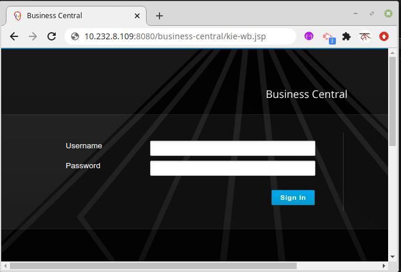
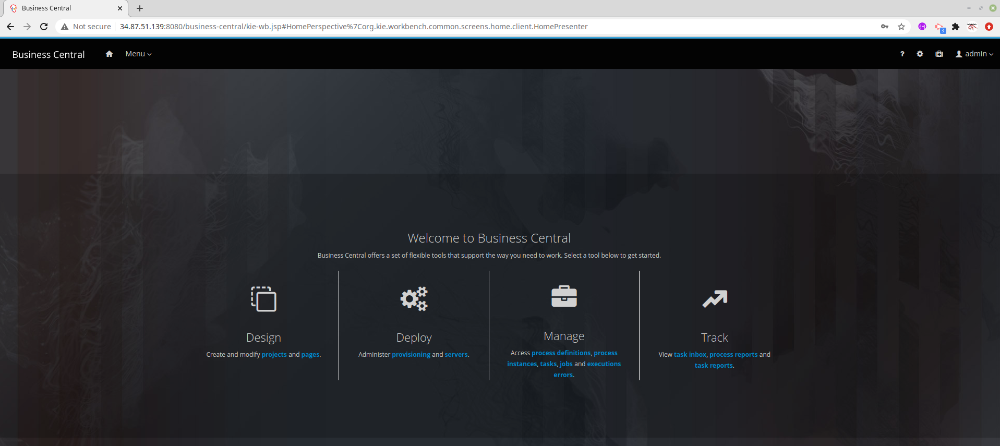
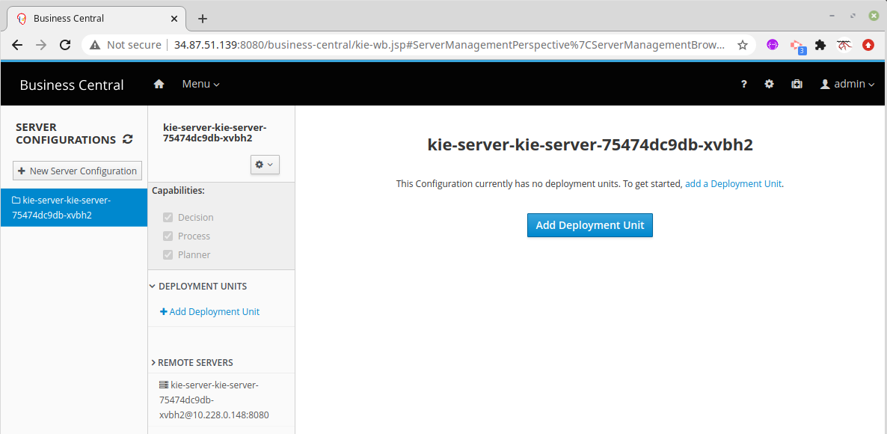
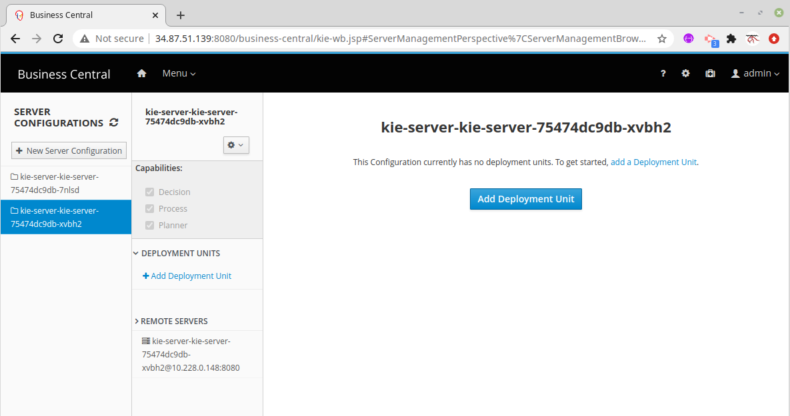

# business-central-workbench-showcase

### Deploy
```
kubectl apply -f kie.yaml

deployment.apps/kie-wb created
service/kie-wb created
service/kie-wb-np created
deployment.apps/kie-server created
service/kie-server created
service/kie-server-np created
```
###

### 
```
kubectl get svc

NAME            TYPE        CLUSTER-IP      EXTERNAL-IP   PORT(S)             AGE
kie-server      ClusterIP   10.232.7.192    <none>        8080/TCP            5s
kie-server-np   NodePort    10.232.8.109    <none>        8080:31002/TCP      4s
kie-wb          ClusterIP   10.232.10.103   <none>        8080/TCP,8001/TCP   5s
kie-wb-np       NodePort    10.232.4.8      <none>        8080:31001/TCP      5s
```
###

### Usage

http://10.232.4.8:31001/business-central



Users and roles
----------------

This showcase image contains default users and roles:

    USER        PASSWORD    ROLE
    *************************************************
    admin       admin       admin,analyst,user,process-admin,kie-server
    krisv       krisv       admin,analyst,user,process-admin,kie-server
    john        john        analyst,Accounting,PM,kie-server
    sales-rep   sales-rep   analyst,sales,kie-server
    katy        katy        analyst,HR,kie-server
    jack        jack        analyst,IT,kie-server




### 
```
kubectl get pods
NAME                          READY   STATUS    RESTARTS   AGE
kie-server-75474dc9db-xvbh2   1/1     Running   0          19s
kie-wb-ccf7d6ccc-swfbv        1/1     Running   0          20s
```
###



### Scale KIE server 
###
```
kubectl  scale deployments/kie-server --replicas=2

deployment.apps/kie-server scaled
```
###

### 
```
kubectl get pods

NAME                          READY   STATUS    RESTARTS   AGE
kie-server-75474dc9db-7nlsd   1/1     Running   0          35s
kie-server-75474dc9db-xvbh2   1/1     Running   0          6m2s
kie-wb-ccf7d6ccc-swfbv        1/1     Running   0          6m3s
```
###

